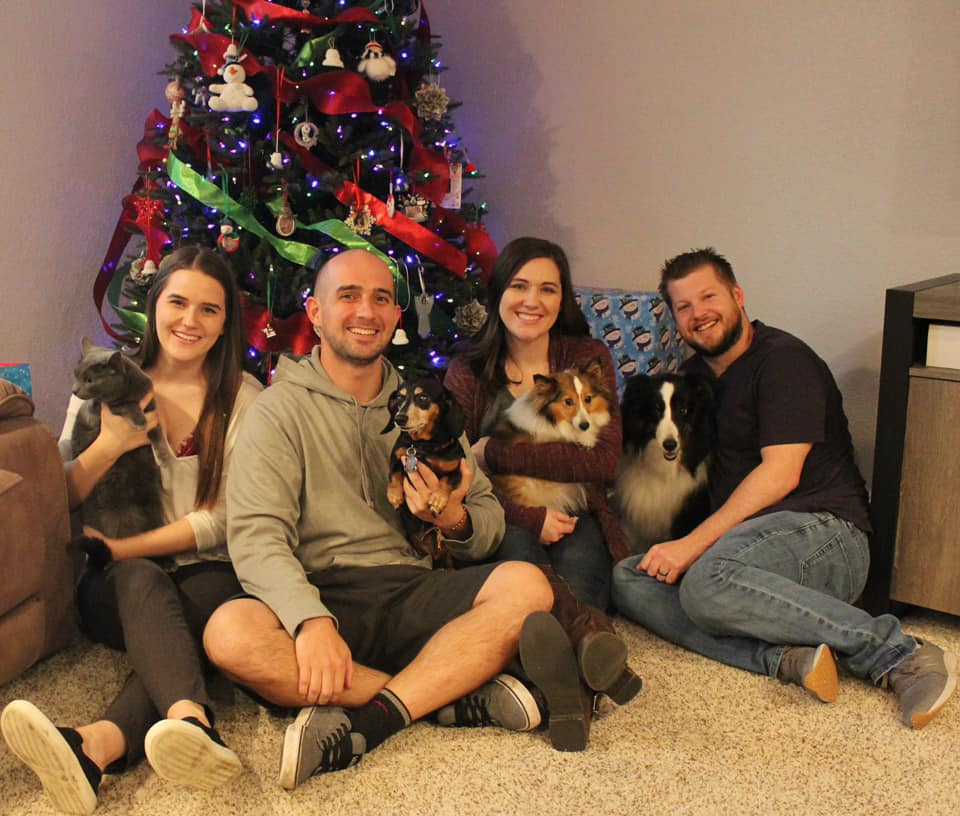
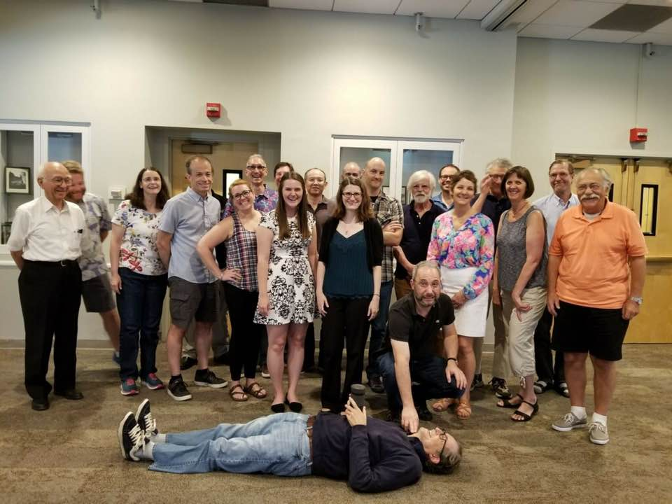
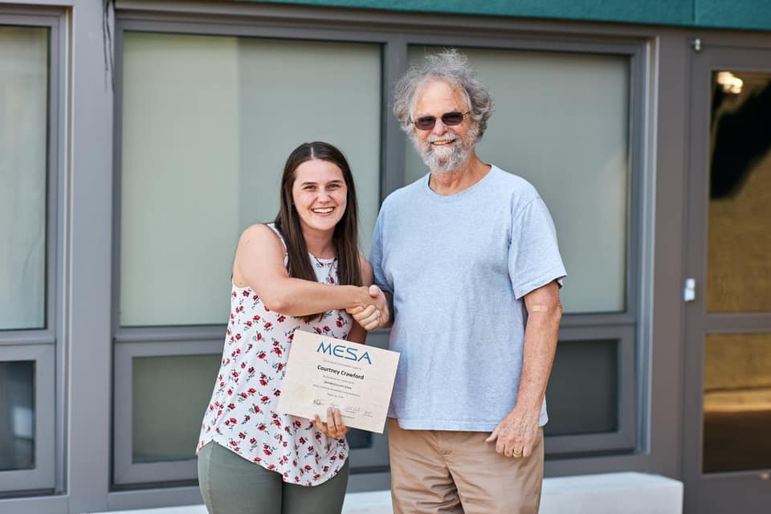

Hi There! I'm Courtney! I use she/her pronouns.

I am a Physics PhD Candidate at Louisiana State University focusing in observational and computational stellar astronomy. I study the rare class of stars known as R Coronae Borealis variables. Additionally, I emcee for [Astronomy on Tap Baton Rouge](https://www.facebook.com/aotbatonrouge/) and I am the former president of our department's [graduate student organization](https://physgradorg.wixsite.com/mysite).

Outside of work, I have many hobbies! I love video games, especially story driven games. These are probably one of my favorite ways to experience a well-written story. I also dabble in quilting and have too many houseplants.

I also was recently recognized by the LSU Graduate School in a [Student Spotlight](http://upload.lsu.edu/graduateschool/spotlight/courtney-crawford.php)

Thanks for visiting! You can find out more about me from the links on the left.

