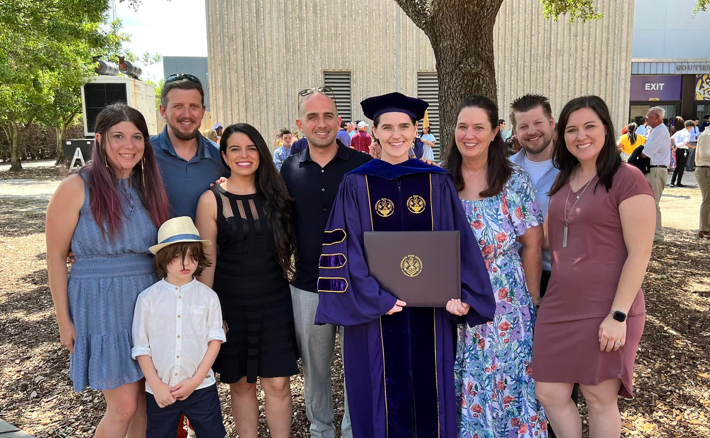

Email: courtney.crawford@sydney.edu.au

Hi, I'm Courtney!

I am a postdoc at the University of Sydney in Australia studying asteroseismology, especially of red giants. I completed my PhD at Louisiana State University on the rare class of stars known as R Coronae Borealis variables. Check out the research tab for more details on my work.

Thanks for visiting! You can find out more about me from the links on the left.

