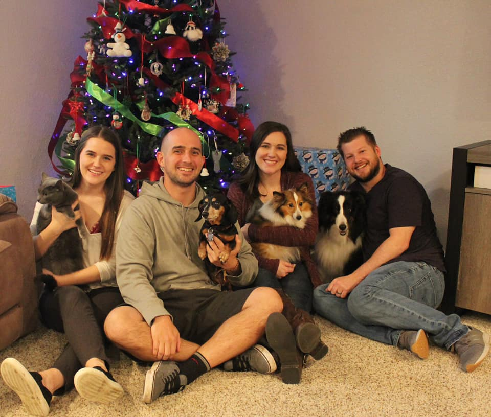
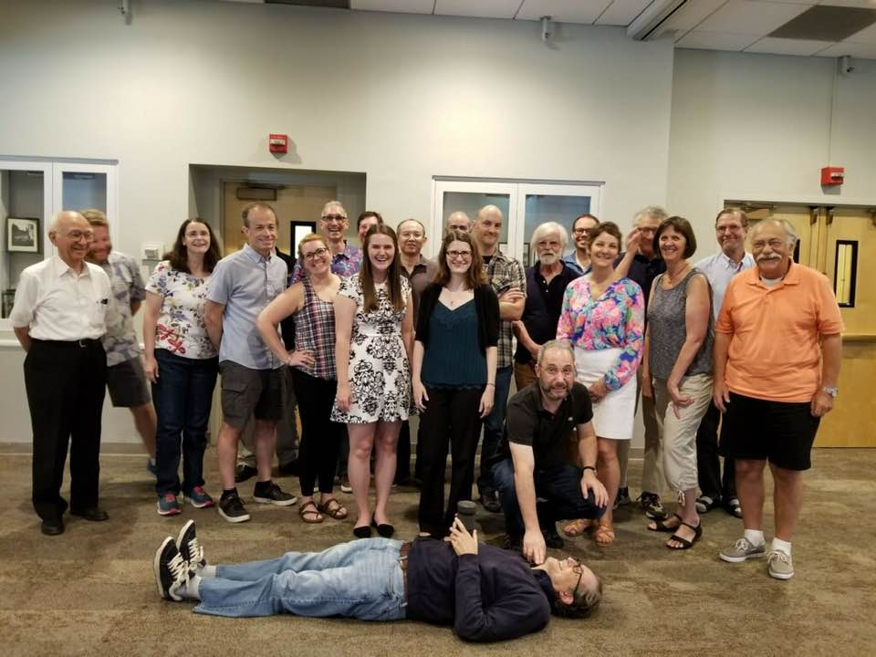
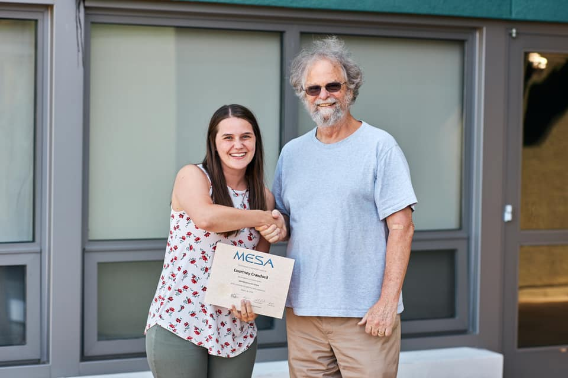

Email: courtney.crawford@sydney.edu.au

Hi, I'm Courtney!

I'm a postdoc currently at the University of Sydney in Australia studying asteroseismology, especially of red giants. I did my PhD at Louisiana State University on the rare class of stars known as R Coronae Borealis variables. Check out the research tab for more details on my work.

At Sydney, I co-host our weekly astronomy seminar series. Back in Louisiana, I was the emcee for [Astronomy on Tap Baton Rouge](https://www.facebook.com/aotbatonrouge/), and was the former president of our department's [graduate student organization](https://physgradorg.wixsite.com/mysite).

Thanks for visiting! You can find out more about me from the links on the left.

