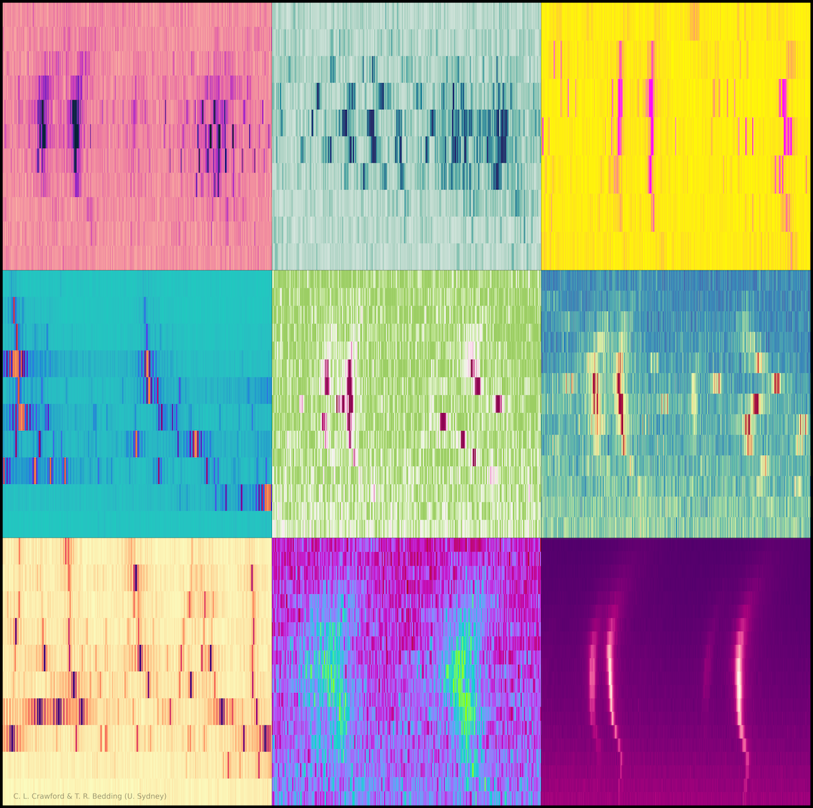

This page serves as a collection of links to downloadable works, talk recordings, etc. that you can freely access if you wish.

## Echelle Artwork

Tim Bedding and I put together this art piece showing an array of oscillating stars. You can download the poster from it and the full-sized image [at this link](https://www.physics.usyd.edu.au/~bedding/echelles/). Free to use with credit for any purpose.

## My Zenodo Archive

Contains links to downloadable material and posters for my published work. [Link here](https://zenodo.org/search?q=metadata.creators.person_or_org.name%3A%22Crawford%2C%20Courtney%22&l=list&p=1&s=10&sort=bestmatch)

## A few recorded talks

Recording of a seminar I gave at Monash about Hydrogen-deficient Carbon stars in 2024 [Link here](https://www.youtube.com/watch?v=3O5YrznmEbI)

Recording of a talk I gave at the TASC/KASC conference in 2025 [Link here](https://www.youtube.com/watch?v=1pCeJh_Gmow&list=PL_-sGAN4eXbUGz5lc2PjbykhRtbEgnVAQ&index=53)

Recording of a seminar I gave at USyd on in 2025 [Link here](https://drive.google.com/file/d/1mphUeNCzlw9ZoJnypmM7uLnqrRVbojQy/view?pli=1)

## A GPR Tutorial that I wrote

This is a tutorial on Gaussian Process Regression in time-series data that I gave at a SPRIGS meeting in 2025. [Link here](https://github.com/courtcraw/SPRIGS2025_GPR_tutorial)

## MESA Workshop Tutorials

MESA Down Under 2024 Day 5 workshop material that I developed is [available here](https://courtcraw.github.io/mesadu_wdbinaries/).

MESA School Leuven 2025 Day 5 workshop material that I developed is [available here](https://mesa-leuven.4d-star.org/tutorials/friday/).

<!-- Academic service is a major portion of each of our careers, and is necessary to keep academia itself running properly. I have spent a significant amount of my early career focusing on service and leadership as much as possible.

At the University of Sydney, I co-host the [SIfA Seminar series](https://sifa.sydney.edu.au/event-seminar/sifa-seminars/), a weekly colloquium series hosted for all members of our local astronomy department. I have served in this position for 3 semesters total. In the most recent semester, I have revamped the organization of this seminar to prioritize efficiency and to help each visitor feel more valued and taken care of while in attendance. I've received very good feedback thus far on these changes. 

I've also brought us into the ECR symposium series with the ASA community


This year, I serve on the LOC and as a Teaching Assistant for the upcoming [MESA Down Under Workshop](https://maygpedersen.github.io/mesa-down-under-2024/) which will take place at USyd in June. While still a work in progress, I am currently developing the website to host our lab information for the [WD Binaries](courtcraw.github.io/mesadu_wdbinaries) section of the MESA Down Under workshop.

I served on the LOC for the [9th Australian Exoplanet Workshop](https://mwanakijiji.github.io/2023/10/02/aew9/). Due to my experience running SIfA Seminars, I performed all the AV work required to run the conference.

While in graduate school at Louisana State, I served for two years on the LSU Physics and Astronomy Department's [Graduate Student Organization](https://physgradorg.wixsite.com/mysite), one year as the vice president and one year as the president. The most important duties of these roles are to collate graduate student opinions on departmental issues and act as the liaison between the students and the faculty. The biggest discussion brought on during my tenure as president was the push for revisions to our departmental qualifying exam. Our survey of the graduate students showed that marginalized identities were both passing the exam later and having a larger mental health impact due to this exam. The discussion within the department regarding changes lasted long after my tenureship, however lasting changes have since been made to the format of this exam.

At LSU, I emceed for the Baton Rouge Astronomy on Tap chapter. You can find many recordings on [FaceBook](https://www.facebook.com/aotbatonrouge/) and all of our virtual shows are available on [YouTube](https://www.youtube.com/c/AoTBR). I also helped to organize and set up the show, and dealt with all of our speakers directly.

During the 2020-2021 academic year (while at LSU), I volunteered with the local Glasgow Middle School [Science Olympiad Team](https://scioly.org/wiki/index.php/Glasgow_Middle_School_(Louisiana)) to help prepare for the Division B Reach for the Stars competition, which is focused on many areas of extra-solar-system astronomy. The team participated in the National Tournament that year, and placed 31st out of 60 teams in the Reach for the Stars category in their first year participating.

I also have volunteered many times during graduate school at the Landolt Observatory at LSU for Public Nights. You can find more information about these at the [Departmental Website](https://www.lsu.edu/physics/about/observatory.php).

LSU also has an event known as Girls' Day at the Museum where K-2nd grade girls come to the campus museum and visit booths set up by the STEM departments. I organized the Physics booth for this event in 2021 where the girls designed and tested stomp rockets.

 -->
